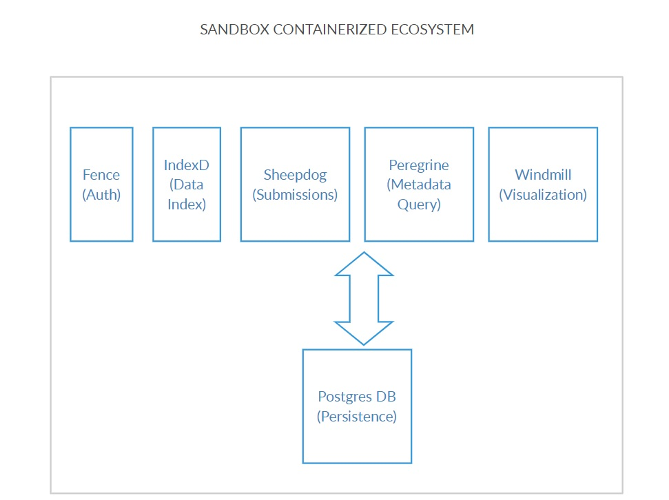
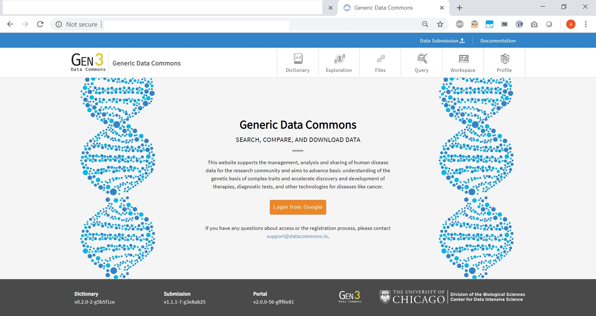
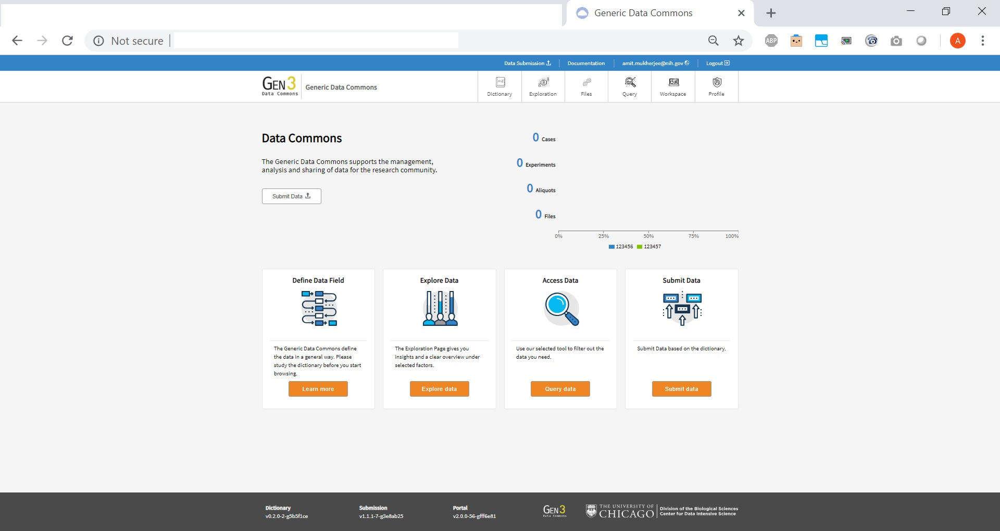

Compose-Services
===

Docker-compose setup for experimental commons, small commons, or local development of the Gen3 stack. Production use should use [cloud-automation](https://github.com/uc-cdis/cloud-automation). 

* [Introduction](#Introduction)
* [Setup](#Setup)
* [Dev Tips](#Dev-Tips)
* [Using the Data Commons](#Using-the-data-commons)


## Introduction
This setup uses Docker containers for postgres, indexd, fence, peregrine, sheepdog, data-portal and nginx. Images for the cdis microservices will be pulled from quay.io (master), while postgres (9.5) and nginx (1.14) images will be pulled from Docker Hub. Nginx will be used as a reverse proxy to each of the services. Config file formats were copied from [cloud-automation](https://github.com/uc-cdis/cloud-automation) and stored in the `api_configs` directory and modified for local use with Docker Compose. Setup scripts for some of the containers are kept in the `scripts` directory.

### Some Database Info
Database setup only has to occur the very first time you setup your local gen3 Docker Compose environment, as this docker-compose environment is configured to create a persistent volume for postgres. The environment configuration is set up to automatically run setup scripts for the postgres container and set up the following:
  1. 3 databases  
      - `metadata_db`
      - `fence_db`
      - `indexd_db`
  2. 4 users with passwords and superuser access
      - `fence_user`
      - `peregrine_user`
      - `sheepdog_user`
      - `indexd_user`

## Setup
### Dependencies
  - openssl
  - Docker and Docker Compose

### Docker Setup
The official Docker installation page can be found [here](https://docs.docker.com/install/#supported-platforms). If you've never used Docker before, it may be helpful to read some of the Docker documentation to familiarize yourself with containers. 

### Docker Compose Setup
If you are using Linux, then the official Docker installation does not come with Docker Compose. The official Docker Compose installation page can be found [here](https://docs.docker.com/compose/install/#prerequisites). You can also read an overview of what Docker Compose is [here](https://docs.docker.com/compose/overview/) if you want some extra background information. Go through the steps of installing Docker Compose for your platform, then proceed to setting up credentials.

### Setting up Credentials
Setup credentials for fence, a custom root CA  and SSL certs with the provided script by running either:
```
bash creds_setup.sh
OR
bash creds_setup.sh YOUR CUSTOM DOMAIN
```
This script will create `temp_creds` and `temp_keys` directories with the credential files in it.
The script by default generate SSL cert for `localhost`, if you are running this in a remote server with an actual domain, you can run `bash creds_setup.sh YOUR_DOMAIN`.  This will create SSL cert signed by the custom CA so that the microservices can talk to each other without bypassing SSL verification. If you are setting this up on AWS, ensure that you use an Elastic IP address BEFORE you set up and use that as your domain.On an EC2 instance for example, this would be your ec2-YOUR-Elastic-IP-Addr.us-region-number.compute.amazonaws.com. This will save a lot of time and avoid editing the individual files to set up the hostname(`fence_creds.json`, `peregrine_creds.json`, and `sheepdog_creds.json`) when the machine is rebooted. This is because each of the microservices can be configured to run on separate machines and thus have their respective configuration files. You will still need to bypass SSL verification when you hit the services from the browser. If you have real certs for your domain, you can copy to `temp_creds/service.key` and `temp_creds/service.crt` to overwrite our dev certs.


If you are using MacOS, you may run into an error with the default MacOS OpenSSL config not including the configuration for v3_ca certificate generation. You can refer to the solution on [this Github issue](https://github.com/jetstack/cert-manager/issues/279) on a related issue on Jetstack's cert-manager.

This Docker Compose setup also requires Google API Credentials in order for the fence microservice to complete its authentication. If you have Google API credentials set up already that you would like to use with the local gen3 Docker Compose setup, simply add `https://localhost/user/login/google/login/` OR `https://YOUR_REMOTE_MACHINE_DOMAIN/user/login/google/login/` to your Authorized redirect URIs in your credentials and copy your client ID and client secret from your credentials to the 'google_client_secret' and 'google_client_id' fields in the `api_configs/fence_creds.json` JSON file.

 If you do not already have Google API Credentials, follow the steps below to set them up. See image below for example on a sample Google account.


### Setting up Google+ API and Google API Credentials for Fence
Fence uses the Google+ API to log users in using their Google Accounts. In order for fence to work properly, the Google+ API must be enabled for the Google Account your are creating Google API Credentials with. To enable the Google+ API, go [the library page of the Google Developer Console](https://console.developers.google.com/apis/library) and search for Google+ API. Click on the card and follow the instructions to enable it.

To set up Google API Credentials, go to [the credentials page of the Google Developer Console](https://console.developers.google.com/apis/credentials) and click the 'Create Credentials' button. Follow the prompts to create a new OAuth Client ID for a Web Application. Add  `https://localhost/user/login/google/login/` OR `https://YOUR_REMOTE_MACHINE_DOMAIN/user/login/google/login/` to your Authorized redirect URIs in the Credentials. Then copy your client ID and client secret and use them to fill in the 'google_client_secret' and 'google_client_id' fields in the `api_configs/fence_creds.json` JSON file.

### Setting up Users
To set up user privileges for the services, please edit the `apis_configs/user.yaml` file, following the example format shown in the file. The fence container will automatically sync this file to the `fence_db` database on startup. If you wish to update user privileges while the containers are running (without restarting the container), just edit the `apis_configs/user.yaml` file and then run
```
docker exec -it compose-services_fence_1 fence-create sync --yaml user.yaml
```
This command will enter the fence container to run the fence-create sync command, which will update your user privileges.

### Start running your local gen3 Docker Compose environment
Now that you are done with the setup, all Docker Compose features should be available. Here are some useful commands:

The basic command of Docker Compose is
```
docker-compose up
``` 
which can be useful for debugging errors. To detach output from the containers, run 
```
docker-compose up -d
``` 
When doing this, the logs for each service can be accessed using
```
docker logs
```
To stop the services use
```
docker-compose down
```
As the Docker images are pulled from quay.io, they do not update automatically. To update your Docker images, run
```
docker-compose pull
docker image prune -f
```
These commands may take a while, and they also may fail. If they do fail, simply rerun them, or just update/remove images one at a time manually.

## Dev Tips
When developing, you can have local repositories of the services you are working on and use volumes to mount your local repository files onto the containers to override the containers' code (which is built from GitHub using quay.io). Then, you can restart a single container with
```
docker-compose restart [CONTAINER_NAME]
```
after you update some code in order to see changes without having to rebuild all the microservices. Keep in mind that running `docker-compose restart` does not apply changes you make in the docker-compose file. Look up the Docker documentation for more information about [volumes](https://docs.docker.com/storage/).

### Running Docker Compose on a Remote Machine
To run Docker Compose on a remote machine, modify the `hostname` field in `fence_creds.json`, `peregrine_creds.json`, and `sheepdog_creds.json` in the `apis_configs` directory.

* * *
### Environent Details
The sandbox ecosystem deployed thus architecturally looks as shown below:



All the microservices communicate with the Postgres Container based on the configuration specified above. Once the services are up and running, the environment can be visualized using the windmill microservice running on port 80 by typing the URL of the machine on which the containers are deployed. Please see example screenshot below as an example:



Upon clicking 'Login from Google' and providing Google Credentials(if the same Google Account is used where the developer credentials came from), the system redirects the user to their landing page as shown below:




## Using the Data Commons
For some general information about Gen3 Data Commons and how they work (such as how to access and submit data), visit the [official site](https://gen3.org/). The section below will go over some useful technical aspects of Gen3.

### Programs and Projects
In a Gen3 Data Commons, programs and projects are two administrative nodes in the graph database that serve as the most upstream nodes. A program must be created first, followed by a project. Any subsequent data submission and data access, along with control of access to data, is done through the project scope.   

To create a program, visit the url where your Gen3 Commons is hosted and append `/_root`. If you are running the Docker Compose setup locally, then this will be `localhost/_root`. Otherwise, this will be whatever you set the `hostname` field to in the creds files for the services with `/_root` added to the end. Here, you can choose to either use form submission or upload a file. I will go through the process of using form submission here, as it will show you what your file would need to look like if you were using file upload. Search for "program," and then fill in the "dbgap_accession_number" and "name" fields, and hit "Submit". If the message is green ("succeeded:200"), that indicates success, while a grey message indicates failure. More details can be viewed by clicking on the "DETAILS" button.

To create a project, visit the url where your Gen3 Commons is hosted and append the name of the program you want to create the project under. For example, if you are running the Docker Compose setup locally and would like to create a project under the program "Program1", the url you will visit will be `localhost/Program1`. You will see the same options to use form submission or upload a file. This time, search for "project," and then fill in the fields and hit "Submit." Again, a green message indicates success while a grey message indicates failure, and more details can be viewed by clicking on the "DETAILS" button.

Once you've created a program and a project, you're ready to start submitting data for that project! Please note that Data Submission refers to meta data regarding the file(s) (Image, Sequencing files etc.)that are to be uploaded. Please refer to the [Gen3 website](https://gen3.org/resources/user/submit-data/) for additional details .

### Controlling access to data
Access to data and admin privileges in Gen3 are controlled using fence through the `user.yaml` file found in the `apis_configs` directory. Admin privileges are required to create administrative nodes, which include programs and projects. For each user, you can control admin status as well as specific per-project permissions. The format of the `user.yaml` file is shown below:
```
users:
  user_email_1:
    admin: True
    projects:
    - auth_id: project1
      privilege: ['create', 'read', 'update', 'delete', 'upload', 'read-storage']
```

Refer to [Setting up Users](#Setting-Up-Users) to review how to apply the changes made in the `user.yaml` file to the database

### Changing the data dictionary
For an introduction to the data model and some essential information for modifying a data dictionary, please read [this](https://gen3.org/docs/submitdata/) before proceeding.

The data dictionary the commons uses is dictated by either the `DICTIONARY_URL` or the `PATH_TO_SCHEMA_DIR` environment variable in both sheepdog and peregrine. The default value for `DICTIONARY_URL` is set to `https://s3.amazonaws.com/dictionary-artifacts/datadictionary/develop/schema.json` and the default value for `PATH_TO_SCHEMA_DIR` is set to the `example-schemas` directory which is downloaded as part of the compose-services repo (from [here](https://github.com/uc-cdis/datadictionary/tree/develop/gdcdictionary/schemas)). Both correspond to the developer test data dictionary, as one is on AWS and one is a local data dictionary setup. To override this default, edit the `environment` fields in the peregrine section of the `docker-compose.yml` file. This will change the value of the environment variable in both sheepdog and peregrine. An example, where the `DICTIONARY_URL` and `PATH_TO_SCHEMA_DIR` environment variables is set to the default values, is provided in the docker-compose.yml.

**NOTE**: Only one of the two environment variables can be active at a time. The data commons will prefer `DICTIONARY_URL` over `PATH_TO_SCHEMA_DIR`. To reduce confusion, keep the variable you're not using commented out.

In addition to changing the `DICTIONARY_URL` or `PATH_TO_SCHEMA_DIR` field, it may also be necesary to change the `APP` environment variable in data-portal. This will only be the case if the alternate dictionary deviates too much from the default dev dictionary.

As this is a change to the Docker Compose configuration, you will need to restart the Docker Compose to apply the changes.
