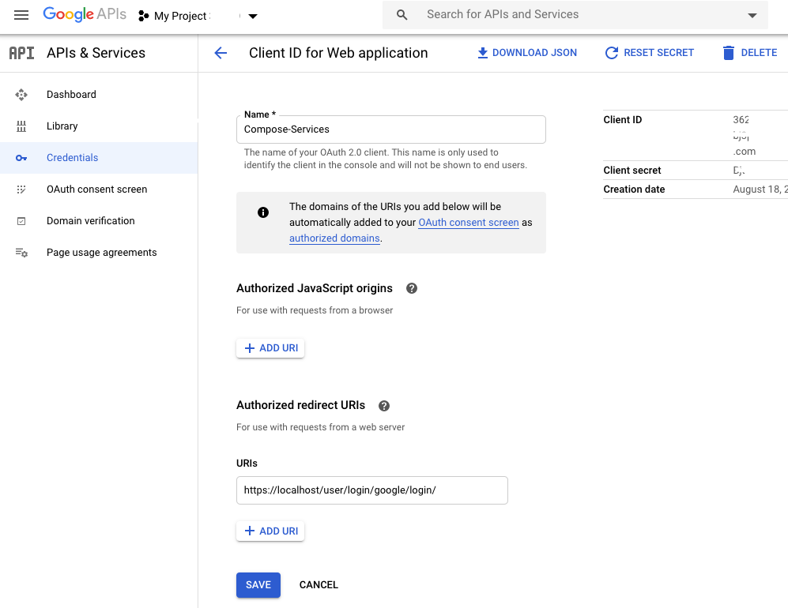

Compose-Services
===

Docker-compose setup for experimental commons, small commons, or local development of the Gen3 stack. Production use should use [cloud-automation](https://github.com/uc-cdis/cloud-automation).

* [Introduction](#Introduction)
* [Setup](#Setup)
* [Dev Tips](#Dev-Tips)
* [Using the Data Commons](#Using-the-data-commons)
* [Useful links](#Useful-links)


## Introduction
This setup uses Docker containers for Postgres, IndexD, Fence, Peregrine, Sheepdog, Windmill (data-portal), and nginx. Images for the [CDIS microservices](https://github.com/uc-cdis/) and nginx will be pulled from quay.io (master), while Postgres (9.5) images will be pulled from Docker Hub. Nginx will be used as a reverse proxy to each of the services. Below you will find information about [migrating existing](#Release-History-and-Migration-Instructions) and [setting up](#Setup) new compose services, some [tips](#Dev-Tips) and basic information about [using](#Using-the-data-commons) data commons. You can quickly find commonly used commands in our [cheat sheet](./docs/cheat_sheet.md). Config file formats were copied from [cloud-automation](https://github.com/uc-cdis/cloud-automation) and stored in the `Secrets` directory and modified for local use with Docker Compose. Setup scripts for some of the containers are kept in the `scripts` directory.

### Release History and Migration Instructions

#### 2019/03 release

The `2019/03` release includes changes necessary for running the latest versions of the `gen3` services as of March 2019.
This release may fail to run earlier versions of `gen3`.

* Changes
  - add `arborist` and `pidgin` services
  - move secrets to `Secrets/` folder which git ignores (via the `.gitignore` file), `apis_configs/` is renamed to a `templates/` folder
  - bump to Postgres `9.6`
  - do not publish Postgres port to host by default - to avoid port conflicts on the host

* Migrate an existing commons to the new setup
    - move the current secrets to `./Secrets`: `mv ./apis_configs Secrets`
    - `git pull`
    - `docker-compose pull` - pull the latest `gen3` Docker images
    - `bash ./creds_setup.sh`
    - edit the `postgres` service in `docker-compose.yaml` to stay on version `9.5` - a `9.6` server cannot read data saved by a `9.5` server.  If you want to erase the data currently in the commons, and proceed with Postgres `9.6`, then `docker-compose down -v` clears the old data.
    - Set the settings in `Secrets/fence-config.yaml` - be sure to set the `client_secret` and `client_id` fields under `OPENID_CONNECT`.
    - ready to go: `docker-compose up -d`

### Some Database Info
Database setup only has to occur the very first time you set up your local gen3 Docker Compose environment, as this docker-compose environment is configured to create a persistent volume for Postgres. The environment configuration is set up to automatically run setup scripts for the postgres container and set up the following:
  1. 4 databases  
      - `metadata_db`
      - `fence_db`
      - `indexd_db`
      - `arborist_db`
  2. 5 users with passwords and superuser access
      - `fence_user`
      - `peregrine_user`
      - `sheepdog_user`
      - `indexd_user`
      - `arborist_user`

Configure the Postgres database container to publish the db service port to the host machine by un-commenting the `ports` block under the `postgres` service in `docker-compose.yml`, then running `docker-compose up -d postgres`:
```
    #
    # uncomment this to make postgres available from the container host - ex:
    #    psql -h localhost -d fence -U fence_user
    ports:
      - 5432:5432
```
The container host can connect to the database after the port is published - ex:
```
psql -h localhost -U fence_user -d fence_db
```

## Setup
### Dependencies
  - openssl
  - Docker and Docker Compose

### Docker Setup
The official Docker installation page can be found [here](https://docs.docker.com/install/#supported-platforms). If you've never used Docker before, it may be helpful to read some of the Docker documentation to familiarize yourself with containers.

### Docker ElasticSearch
If you are running on AWS EC2 instance (Amazon Linux), consider setup [Docker ElasticSearch prerequisites](https://www.elastic.co/guide/en/elasticsearch/reference/current/docker.html#docker-prod-prerequisites). The following are known to be required to set on Docker host:
```
grep vm.max_map_count /etc/sysctl.conf
vm.max_map_count=262144
```

### Docker Compose Setup
The official Docker Compose installation page can be found [here](https://docs.docker.com/compose/install/#prerequisites). Go through the steps of installing Docker Compose for your platform, then proceed to set up credentials. You can also read an overview of what Docker Compose is [here](https://docs.docker.com/compose/overview/) if you want some extra background information. If you are using Linux, then the official Docker installation does not come with Docker Compose; you will need to install Docker Engine before installing Docker Compose.  

### Setting up Credentials
Setup credentials for Fence, a custom root CA  and SSL certs with the provided script by running either:
```
bash ./creds_setup.sh
OR
bash ./creds_setup.sh YOUR CUSTOM DOMAIN
```
This script will create a `Secrets` folder that holds various secrets and configuration files.
The script by default generates an SSL certificate to access the gen3 stack at `https://localhost`. OpenSSL should create the `jwt_private_key.pem` and `jwt_public_key.pem` in the `Secrets/fenceJwtKeys/{dateTtimeZ}` folder. If you do not see them, make sure your version of OpenSSL is correct.
If you are running this in a remote server with an actual domain, you can run `bash creds_setup.sh YOUR_DOMAIN`.  This will create SSL cert signed by the custom CA so that the microservices can talk to each other without bypassing SSL verification. If you are setting this up on AWS, ensure that you use an Elastic IP address BEFORE you set up and use that as your domain. On an EC2 instance, for example, this would be your ec2-YOUR-Elastic-IP-Addr.us-region-number.compute.amazonaws.com. This will save a lot of time and avoid [editing the individual files](#Running-Docker-Compose-on-a-Remote-Machine) to set up the hostname(`fence-config.yaml`, `peregrine_creds.json`, and `sheepdog_creds.json`) when the machine is rebooted. This is because each of the microservices can be configured to run on separate machines and thus have their respective configuration files. You will still need to bypass SSL verification when you hit the services from the browser. If you have real certs for your domain, you can copy to `Secrets/TLS/service.key` and `Secrets/TLS/service.crt` to overwrite our dev certs.

If you are using MacOS, you may run into an error with the default MacOS OpenSSL config not including the configuration for v3_ca certificate generation. You can refer to the solution on [this Github issue](https://github.com/jetstack/cert-manager/issues/279) on a related issue on Jetstack's cert-manager. 

Support for multi-tenant (another fence is this fence's IDP) is available and can be edited in the `fence-config.yaml`. If this is not the case, we recommend removing the [relevant section](https://github.com/uc-cdis/compose-services/blob/fa3dcc95a4244805c7a02f315cd330447e189945/templates/fence-config.yaml#L81).

### Setting up Google OAuth Client-Id for Fence

This Docker Compose setup requires Google API Credentials in order for Fence microservice to complete its authentication. 
To set up Google API Credentials, go to [the Credentials page of the Google Developer Console](https://console.developers.google.com/apis/credentials) and click the 'Create Credentials' button. Follow the prompts to create a new OAuth Client ID for a Web Application. Add  `https://localhost/user/login/google/login/` OR `https://YOUR_REMOTE_MACHINE_DOMAIN/user/login/google/login/` to your Authorized redirect URIs in the Credentials and click 'Create'. Then copy your client ID and client secret and use them to fill in the 'google.client_secret' and 'google.client_id' fields in the `Secrets/fence-config.yaml` file. 
See image below for an example on a sample Google account.



If you have Google API credentials set up already that you would like to use with the local gen3 Docker Compose setup, simply add `https://localhost/user/login/google/login/` OR `https://YOUR_REMOTE_MACHINE_DOMAIN/user/login/google/login/` to your Authorized redirect URIs in your credentials and copy your client ID and client secret from your credentials to the 'client_secret' and 'client_id' fields in the `Secrets/fence-config.yaml` under `OPENID_CONNECT` and `google`.

### Setting up Users
To set up user privileges for the services, please edit the `Secrets/user.yaml` file, following the example format shown in [this file](https://github.com/uc-cdis/fence/blob/master/docs/base_user.yaml). In particular, you should change all occurrences of `yourlogin@gmail.com` to the email you intend to log in with, so that you can create administrative nodes later on.

Fence container will automatically sync this file to the `fence_db` database on startup. If you wish to update user privileges while the containers are running (without restarting the container), just edit the `Secrets/user.yaml` file and then run
```
docker exec -it fence-service fence-create sync --arborist http://arborist-service --yaml user.yaml
```
This command will enter Fence container to run the fence-create sync command, which will update your user privileges. If you are logged in to your commons on a browser, you may need to log out and log back in again or clear your cookies in order to see the changes.


### Start running your local gen3 Docker Compose environment
If your Gen3 data commons does not host any data, yet, we recommend commenting out the [kibana-service section](https://github.com/uc-cdis/compose-services/blob/master/docker-compose.yml#L270-L281) in the `docker-compose.yaml` and the [guppy section](https://github.com/uc-cdis/compose-services/blob/master/nginx.conf#L120-L124) in the `ninx.conf` file. After having setup the first program/project and uploaded the first data, we recommend enabling these sections. 

Now that you are done with the setup, all Docker Compose features should be available. If you are a non-root user you may need to add yourself to the 'docker' group: `sudo usermod -aG docker your-user`, and the log out and log back in. 
Here are some useful commands:

The basic command of Docker Compose is
```
docker-compose up
```
which can be useful for debugging errors. To detach output from the containers, run
```
docker-compose up -d
```
When doing this, the logs for each service can be accessed using
```
docker logs
```
To stop the services use
```
docker-compose down
```
As the Docker images are pulled from quay.io, they do not update automatically. To update your Docker images, run
```
docker-compose pull
docker image prune -f
```
These commands may take a while, and they also may fail. If they do fail, simply rerun them, or just update/remove images one at a time manually.
Sheepdog and Peregrine services download the dictionary schema at startup, and the
portal service runs a series of pre-launch compilations that depend on Sheepdog and Peregrine,
so it may take several minutes for the portal to finally come up at https://localhost
Following the portal logs is one way to monitor its startup progress:
```
docker logs -f portal-service
```

### Update tips
You should of course `git pull` compose-services if you have not done so for a while. You also need to `docker-compose pull` new images from Quay--this will not happen automatically. If your git pull pulled new commits, and you already have a `Secrets` folder, you may also need to delete your old `Secrets` and rerun `creds_setup.sh` (see [Setting up Credentials](#Setting-up-Credentials)) to recreate it. 

## Dev Tips

You can quickly find commonly used commands for compose services in our [cheat sheet](./docs/cheat_sheet.md).

When developing, you can have local repositories of the services you are working on and use volumes to mount your local repository files onto the containers to override the containers' code (which is built from GitHub using quay.io). Then, you can restart a single container with
```
docker-compose restart [CONTAINER_NAME]
```
after you update some code in order to see changes without having to rebuild all the microservices. Keep in mind that running `docker-compose restart` does not apply changes you make in the docker-compose file. Look up the Docker documentation for more information about [volumes](https://docs.docker.com/storage/).

### Running Docker Compose on a Remote Machine
To run Docker Compose on a remote machine, modify the `BASE_URL` field in `fence-config.yaml`, and the `hostname` field in `peregrine_creds.json` and `sheepdog_creds.json` in the `Secrets` directory.

### Dumping config files and logs (MacOS/Linux)

If you are encountering difficulties while setting up Docker Compose and need help from the Gen3 team, you can use the `dump.sh` script to create a zip file of your configuration and current logs, which you can share to get help.
```
bash dump.sh
```
Note that if docker-compose is not running, the logs will be empty.

The following configuration files will be included:
* docker-compose.yml
* user.yaml
* any file ending with "settings" or "config"

Credentials files are NOT included and lines containing "password", "secret" or "key" are removed from other files.
If your files contain other kinds of sensitive credentials, make sure to remove them before running the script.

### Environment Details
The sandbox ecosystem deployed thus architecturally looks as shown below:


All the microservices communicate with the Postgres Container based on the configuration specified above. Once the services are up and running, the environment can be visualized using the windmill microservice running on port 80 by typing the URL of the machine on which the containers are deployed. Please see example screenshot below as an example:


Upon clicking 'Login from Google' and providing Google Credentials(if the same Google Account is used where the developer credentials came from), the system redirects the user to their landing page as shown below:


## Using the Data Commons
For some general information about Gen3 Data Commons and how they work (such as how to access and submit data), visit the [official site](https://gen3.org/). The section below will go over some useful technical aspects of Gen3.

### Smoke test

The `smoke_test.sh` script queries the health-check endpoints of each service
launched by `docker-compose.yml`.
```
bash smoke_test.sh localhost
```

### Programs and Projects
In a Gen3 Data Commons, programs and projects are two administrative nodes in the graph database that serve as the most upstream nodes. A program must be created first, followed by a project. Any subsequent data submission and data access, along with control of access to data, is done through the project scope.

In order to create a program or a project, you need administrator privileges. If not done before, edit the `Secrets/user.yaml` file and set up your privileges for the services, programs, and projects following the example format shown in the file or [here](https://github.com/uc-cdis/fence/blob/master/docs/user.yaml_guide.md#programs-and-projects-crud-access).

To create a program, visit the URL where your Gen3 Commons is hosted and append `/_root`. If you are running the Docker Compose setup locally, then this will be `localhost/_root`. Otherwise, this will be whatever you set the `hostname` field to in the creds files for the services with `/_root` added to the end. Here, you can choose to either use form submission or upload a file.  I will go through the process of using form submission here, as it will show you what your file would need to look like if you were using file upload. Choose form submission, search for "program" and then fill in the "dbgap_accession_number" and "name" fields.
The resource tree contains, among other resources, the programs and projects created via Sheepdog. If you created a program `{ "name": "program1" }` and a project `{ "name": "project1", "dbgap_accession_number": "phs1", "code": "P1" }`, your resource tree should contain the following:
```
  resources:
  - name: programs
    subresources:
    - name: program1
      subresources:
      - name: projects
        subresources:
        - name: P1
```
Policies would refer to this resource as /programs/program1/projects/P1.

Click 'Upload submission json from form' and then 'Submit'. If the message is green ("succeeded:200"), that indicates success, while a grey message indicates failure. More details can be viewed by clicking on the "DETAILS" button. If you don't see the green message, control the sheepdog logs in case errors have occurred, make sure that [you have program/project submission access](https://github.com/uc-cdis/fence/blob/master/docs/user.yaml_guide.md#programs-and-projects-crud-access), or look into the Sheepdog database (`/datadictionary`), where programs and projects are stored. If you see your program in the data dictionary, neglect the fact that at this time the green message does not appear and continue to create a project.

To create a project, visit the URL where your Gen3 Commons is hosted and append the name of the program you want to create the project under. For example, if you are running the Docker Compose setup locally and would like to create a project under the program "Program1", the URL you will visit will be `localhost/Program1`. You will see the same options to use form submission or upload a file. This time, search for "project" and then fill in the fields. Using the example above, you can use "P1" as "code", "phs1" as "dbgap_accession_number", and "project1" as "name". If you use different entries, make a note of the dbgap_accession_number for later. Click 'Upload submission json from form' and then 'Submit'. Again, a green message indicates success while a grey message indicates failure, and more details can be viewed by clicking on the "DETAILS" button. You should also see the program and project in the data dictionary.

Once you've created a program and a project, you need to grant yourself permissions on your new project in order to submit data. You can edit the `user.yaml` according to the above shown resource tree. Also, insert under `/resource_paths` in policies the path mentioned above. If you created a project for which you already had permissions--for example, if you used the template under `youruser@gmail.com` in the `user.yaml` and created a project called "Program1", then you can skip this step. See [Controlling access to data](#Controlling-access-to-data) for an example. The `auth_id` should be a string containing the `dbgap_accession_number` of your project. Make sure to update user privileges:
```
docker exec -it fence-service fence-create sync --arborist http://arborist-service --yaml user.yaml
```
After that, you're ready to start submitting data for that project! Please note that Data Submission refers to metadata regarding the file(s) (Image, Sequencing files, etc.) that are to be uploaded. Please refer to the [Gen3 website](https://gen3.org/resources/user/submit-data/) for additional details.


### Controlling access to data
Access to data and admin privileges in Gen3 is controlled using Fence through the `user.yaml` file found in the `Secrets` directory. Admin privileges are required to create administrative nodes, which include programs and projects. For each user, you can control admin status as well as specific per-project permissions. The format of the `user.yaml` file is shown below:
```
users:
  user_email:
    admin: True
    projects:
    - auth_id: project_dbgap_accession_number
      privilege: ['create', 'read', 'update', 'delete', 'upload', 'read-storage']
```

Refer to [Setting up Users](#Setting-Up-Users) to review how to apply the changes made in the `user.yaml` file to the database

### Generating Test Metadata

The `gen3` stack requires metadata submitted to the system to conform
to a schema defined by the system's dictionary.  The `gen3` developers
use a tool to generate test data that conforms to a particular dictionary.
For example - the following commands generate data files suitable to submit
to a `gen3` stack running the default genomic dictionary at https://s3.amazonaws.com/dictionary-artifacts/datadictionary/develop/schema.json

```
export TEST_DATA_PATH="$(pwd)/testData"
mkdir -p "$TEST_DATA_PATH"

docker run -it -v "${TEST_DATA_PATH}:/mnt/data" --rm --name=dsim --entrypoint=data-simulator quay.io/cdis/data-simulator:master simulate --url https://s3.amazonaws.com/dictionary-artifacts/datadictionary/develop/schema.json --path /mnt/data --program jnkns --project jenkins --max_samples 10
```

### Changing the data dictionary
For an introduction to the data model and some essential information for modifying a data dictionary, please read [this](https://gen3.org/docs/submitdata/) before proceeding.

The data dictionary the commons uses is dictated by either the `DICTIONARY_URL` or the `PATH_TO_SCHEMA_DIR` environment variable in both Sheepdog and Peregrine. The default value for `DICTIONARY_URL` are set to `https://s3.amazonaws.com/dictionary-artifacts/datadictionary/develop/schema.json` and the default value for `PATH_TO_SCHEMA_DIR` is set to the `datadictionary/gdcdictionary/schemas` directory which is downloaded as part of the compose-services repo (from [here](https://github.com/uc-cdis/datadictionary/tree/develop/gdcdictionary/schemas)). Both correspond to the developer test data dictionary, as one is on AWS and one is a local data dictionary setup. To override this default, edit the `environment` fields in the `peregrine-service` section of the `docker-compose.yml` file. This will change the value of the environment variable in both Sheepdog and Peregrine. An example, where the `DICTIONARY_URL` and `PATH_TO_SCHEMA_DIR` environment variables is set to the default values, is provided in the docker-compose.yml.

**NOTE**: Only one of the two environment variables can be active at a time. The data commons will prefer `DICTIONARY_URL` over `PATH_TO_SCHEMA_DIR`. To reduce confusion, keep the variable you're not using commented out.

There are 3 nodes that are required for the dev (default) portal--`case`, `experiment`, and `aliquot`. If you remove any one of these, then you will also need to [change](https://github.com/uc-cdis/compose-services/blob/master/docs/cheat_sheet.md) the `APP` environment variable in `portal-service`, in addition to changing the `DICTIONARY_URL` or `PATH_TO_SCHEMA` field.

As this is a change to the Docker Compose configuration, you will need to restart the Docker Compose (`docker-compose restart`) to apply the changes.

### Configuring guppy for exploration page 
In order to enable guppy for exploration page, the `gitops.json`, `etlMapping.yaml` and `guppy_config.json` need to be configured. There are some examples of configurations located at `https://github.com/uc-cdis/cdis-manifest`. It is worth to mentioning that the index and type in `guppy_config.json` need to be matched with the index in `etlMpping.json`.
 
 When the data dictionary is changed, those files are also configured accordingly so that the exploration page can work.

 Run `bash ./guppy_setup.sh` to create/re-create ES indices


### Enabling data upload to s3

The templates/user.yaml file has been configured to grant data_upload privileges to the `yourlogin@gmail.com` user.  Connect it to your s3 bucket by configuring access keys and bucket name in `fence-config.yaml`.

```
289,290c289,290
<     aws_access_key_id: 'your-key'
<     aws_secret_access_key: 'your-key'
---
>     aws_access_key_id: ''
>     aws_secret_access_key: ''
296c296
<   your-bucket:
---
>   bucket1:
309c309
< DATA_UPLOAD_BUCKET: 'your-bucket'
---
> DATA_UPLOAD_BUCKET: 'bucket1'
```
## Useful links 
These links show insightful work conducted by other users in the Gen3 community and may be of help to new and experienced users/operators alike of a Gen3 data commons. 
We emphasize that we are not responsible for the content and opinions on the third-party webpages listed below.
1. Working with on premises data and servers: 
The gen3 system is optimized to deploy on cloud systems and work with cloud buckets. The Oregon Health & Science University (OHSU) has developed [a collection of extensions](https://github.com/ohsu-comp-bio/compose-services/tree/onprem) to enable gen3 to work in a non aws environment.  Read this [overview](https://github.com/ohsu-comp-bio/compose-services/blob/onprem/onprem/README.md) for more information.
2. A group of users shared their experiences with setting up their first program and project on a local desktop using Compose Services in August 2020 in form of two videos: [Gen3 Data Commons Setup Part 1](https://www.youtube.com/watch?v=xM54O4aMpWY) and [Gen3 Data Commons Setup Part 2](https://www.youtube.com/watch?v=iMmCxnbHpGo).
