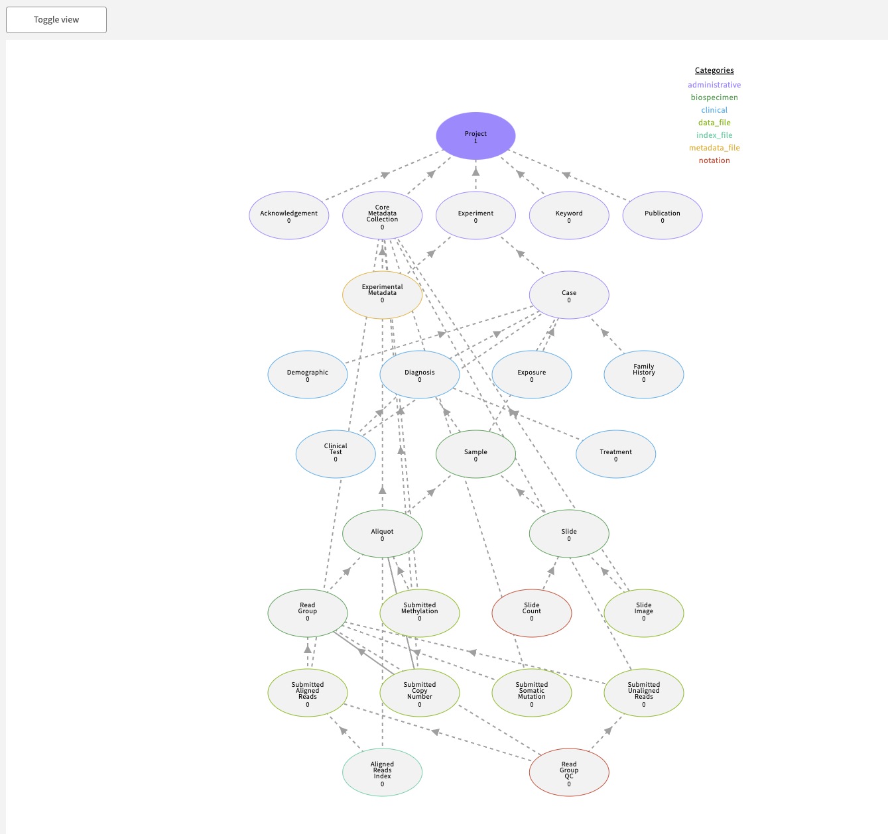

# ACED specific changes


## Fence

  ## setup

  See compose services docs for `bash ./creds_setup.sh aced-training.compbio.ohsu.edu`

  ## windmill's auth display
  
  add to gitops.json
  ```
  "showArboristAuthzOnProfile": true,
  "showFenceAuthzOnProfile": false
  ```

  ## migrations
  In Secrets/fence-config.yaml
  ```
  ENABLE_DB_MIGRATION: false 
  ```

  ## Authentication

  * Let's turn off auth: Secrets/fence-config.yaml#L48-L49

        ```
        # if true, will automatically login a user with username "test"
        MOCK_AUTH: true
        ```

        * Then adjust the user mapping to make the "test" user admin. In Secrets/user.yaml, change all occurances of `username1@gmail.com` to `test`


        * Then restart fence.

        ```
        docker-compose stop fence-service ; docker-compose rm  -f fence-service ; docker-compose up fence-service ;
        ```

  ## certs

    If you are on an exastack node (or AWS instance):
    
    ohsu intranet wild card cert
    https://ohsuitg-my.sharepoint.com/:f:/g/personal/walsbr_ohsu_edu/ElinLNATlvFPiI6jHp6oR04BLPnVFUT76chpbRbykJWTbQ?e=EorNnL

    * copy certs commands, assuming certs directory in ~/compbio-tls

    ```

    cp /home/ubuntu/compbio-tls/compbio-tls/compbio.ohsu.edu-2022.interim-bundle.pem  ./Secrets/TLS/service.crt
    cp /home/ubuntu/compbio-tls/compbio-tls/compbio.ohsu.edu-2022.key ./Secrets/TLS/service.key   

    ```


## Data

    * Per instructions, disable guppy and kibana

    * Create a program and project.  See https://github.com/uc-cdis/compose-services/blob/master/docs/using_the_commons.md#programs-and-projects


    * Let's generate some data

        ```
        export TEST_DATA_PATH="$(pwd)/testData"
        mkdir -p "$TEST_DATA_PATH"

        docker run -it -v "${TEST_DATA_PATH}:/mnt/data" --rm --name=dsim --entrypoint=data-simulator quay.io/cdis/data-simulator:master simulate --url https://s3.amazonaws.com/dictionary-artifacts/datadictionary/develop/schema.json --path /mnt/data --program MyFirstProgram --project MyFirstProject --max_samples 10
        ```

    * Load the data manually by following the instructions in 
        https://gen3.org/resources/user/submit-data/#begin-metadata-tsv-submissions  (Note that the data we will be using is in JSON form.) This will be a good opportunity to discover data dependency order. Navigate to the "Submit Data" page. Load the data, following the hierarchy displayed in the "Toogle View"



## API

This may be a good time to examine the Gen3 API.  For example, view the `metadata` script:

```
    $ ./etl/metadata ls | jq .
    {
      "programs": {
        "MyFirstProgram": [
          "MyFirstProject",
          "MySecondProject"
        ]
      },
      "entities": [
        "program",
        "project",
        "acknowledgement",
        "core_metadata_collection",
        "experiment",
        "keyword",
        "publication",
        "experimental_metadata",
        "submitted_copy_number",
        "case",
        "demographic",
        "diagnosis",
        "sample",
        "exposure",
        "family_history",
        "clinical_test",
        "aliquot",
        "slide",
        "treatment",
        "slide_image",
        "submitted_methylation",
        "read_group",
        "slide_count",
        "submitted_aligned_reads",
        "submitted_somatic_mutation",
        "submitted_unaligned_reads",
        "aligned_reads_index",
        "read_group_qc"
      ]
    }

```

## Re-Enable guppy

  * (Re)Read the [documentation](https://github.com/uc-cdis/compose-services/blob/master/docs/using_the_commons.md#configuring-guppy-for-exploration-page)  
  * Rollback comment out of guppy in nginx.conf
  * Rollback comment out of kibana in docker-compose.yml
  * Run `bash guppy_setup.sh`  
      

## Let's setup discovery

* Update the metadata service image

```
   metadata-service:
-    image: "quay.io/cdis/metadata-service:2021.03"
+    image: "quay.io/cdis/metadata-service:1.8.0"
     container_name: metadata-service
     depends_on:
       - postgres
+    volumes:
+      # /env/bin/python /src/src/mds/populate.py --config /var/local/metadata-service/aggregate_config.json
+      - ./Secrets/metadata/aggregate_config.json:/var/local/metadata-service/aggregate_config.json
     environment:
       - DB_HOST=postgres
       - DB_USER=metadata_user
       - DB_PASSWORD=metadata_pass
       - DB_DATABASE=metadata
+      - USE_AGG_MDS=true
+      - GEN3_ES_ENDPOINT=http://esproxy-service:9200
     command: >
```


